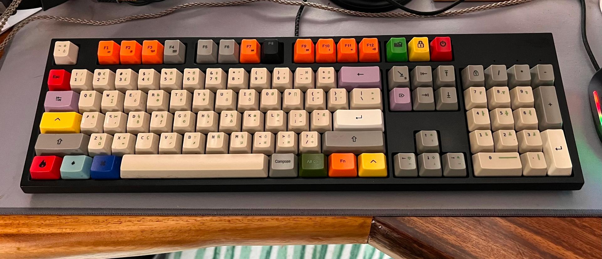

# Customizing your Linux keymap without `xkbcomp`

This repository contains two worked, real examples for how to do key-by-key mapping of your
layout using the XKB system, in a way that works with all the native keyboard mapping
configuration.

One example keyboard is the 'us-mac' keymap, here brought to life with custom keycaps from
WASD keyboards:

There are some customizations to the layout from standard 'us-mac'; this repo shows you how
to go through the rest.

This repository also provides a _US variant_ layout that supports Italians deadkeys
(i.e. vowels with diacritics) especially meant for [Kinesis Advantage
keyboard](http://www.kinesis-ergo.com/shop/advantage-for-pc-mac/).

This is the original Dvorak US layout:

and this is the Dvorak US layout with Italian variant:

The original author wrote of this:

> I'm sure that you can learn from here everything you need to build, remap and customize your
> own keyboard layout for Linux.

And so, I did!

If you need some help to understand better how all the parts are working, please have a look
at [his guide on Medium.com](https://medium.com/@damko/a-simple-humble-but-comprehensive-guide-to-xkb-for-linux-6f1ad5e13450#.gnyfmp6y4) 
or file a question as a documentation bug/wishlist issue against this repo!

## Pre-Installation safety backup

In these instructions, we will be modifying files in your OS directories.  This isn't ideal
for a few reasons:

* upgrading your OS will blow away the changes

* reverting to a previous version may be difficult (especially using a broken keymap!)

* changing files in `/usr` (not `/usr/local`) is considered bad practice and people will
  frown and tut-tut at you.

Don't let the haters hate!  If they say anything, just say "yeah.  That's how I roll (my own
Linux)".

Seriously though, if anyone has any way to add to XKB _without_ customizing this directory
directly, please let me know!

### Before installing this repo

Run a backup of your current `/usr/share/X11/xkb` configuration directory

    su -
    cd /usr/share/X11/
    tar zcf previous-xkb.tgz xkb

So that you can roll back any time.

### Rolling back all changes

You can use this command sequence to restore the backup made in the previous section:

    su -
    cd /usr/share/X11/
    rm -fR xkb
    tar zxf previous-xkb.tgz

If you couldn't find the file, or something still doesn't work, you can try re-installing
the package that delivers that file.  On Debian/Ubuntu, you query that package with `dpkg -S
PATH` and then `apt reinstall PACKAGE` will reinstall for you.

    $ dpkg -S /usr/share/X11/xkb
    xkb-data: /usr/share/X11/xkb
    $ sudo apt reinstall xkb-data
    Reading package lists... Done
    Building dependency tree... Done
    Reading state information... Done
    0 upgraded, 0 newly installed, 1 reinstalled, 0 to remove and 5 not upgraded.
    Need to get 392 kB of archives.
    After this operation, 0 B of additional disk space will be used.
    Get:1 http://www.gtlib.gatech.edu/pub/ubuntu noble/main amd64 xkb-data all 2.38-2 [392 kB]
    Fetched 392 kB in 0s (6,429 kB/s)
    (Reading database ... 462397 files and directories currently installed.)
    Preparing to unpack .../xkb-data_2.38-2_all.deb ...
    Unpacking xkb-data (2.38-2) over (2.38-2) ...
    Setting up xkb-data (2.38-2) ...
    Processing triggers for man-db (2.12.0-3) ...
    $

## Install

Copy the files on top of the files in your Xorg; for instance, on Debian/Ubuntu:

    git clone git@github.com:samv/xkb_custom.git
    cd xkb_custom
    sudo cp -fR geometry keycodes rules symbols /usr/share/X11/xkb/

Once you have done this, you can change your keyboard layout using the regular
configurations in Gnome Control Center (and gnome-tweaks), or using the command-line
equivalents:

    setxkbmap -model kinesis -layout us -variant kinesis_adv_dvorak_it -option
    setxkbmap -model kinesis -layout us -variant kinesis_adv_dvorak_it -option -option "lv3:rwin_switch"

You will end up with a standard American Dvorak layout with all the additional vowels with
diacritics required for the Italian language.

For the mac-hip layout:

     setxkbmap -layout us -model pc104 -variant mac-hip -option "lv3:ralt_switch,numpad:mac"

## Typing vowels using diacritic deadkeys

* master
* hack

**hack** is the branch you might be interested in and contains the modified files. **master** contains the original files, you know, in case of need and for [comparison](https://github.com/damko/xkb_kinesis_advantage_dvorak_layout/compare).

    git clone git@github.com:damko/xkb_kinesis_advantage_dvorak_layout.git
    cd xkb_kinesis_advantage_dvorak_layout
    git checkout hack
    sudo cp -fR geometry keycodes rules symbols /usr/share/X11/xkb/

These commands will apply the changes:

    setxkbmap -model kinesis -layout us -variant kinesis_adv_dvorak_it -option
    setxkbmap -model kinesis -layout us -variant kinesis_adv_dvorak_it -option -option "lv3:rwin_switch"

You will end up with a standard American Dvorak layout with all the additional vowels with diacritics required for the Italian language.

### Kinesis Italian deadkeys

With the Kinesis Italian layout in this repo, to type a character with a grave mark (`), use
Win+R, then the vowel you want the grave over.

### mac-hip deadkeys

The standard Mac US keyboard layout is already quite hip, sporting a wide variety of
deadkeys accessed by the "Option" key, which I'll call "AltGr" from here on.  It also has
some non-deadkey productions, like AltGr+A produces å, AltGr+Shift+A produces Å.  This is
great if you type å a lot, but for most English–speaking hipsters it's a waste of a key
combination.

The "mac-hip" layout replaces all single accented letter combinations with either a deadkey
for the diacritic, if there is not a diacritical mark already, freeing up 1 combination for
something more hip, or if there is already a deadkey for that diacritic, both combinations
are freed up.  It also eschews mathematical symbols in place of more useful marks (eg,
AltGr+V produces a real check ✓, not square root √)

There's two exceptions: AltGr+N produces ñ, AltGr+C produces ç, and with shift you get the
capitalized versions Ñ and Ç.  This AltGr+C behavior is unchanged from the standard Mac US
layout.

#### Standard mac US deadkeys

The following deadkeys are default in MacOS already, and available with the 'mac' keyboard
variant without installing this repo;

* AltGr+Backtick: grave (ˋ, eg è, used in French, Italian and otehrs)

* AltGr+Shift+Backtick: horn (eg ơ, used in Vietnamese)

* AltGr+E: acutE (´, eg é)

* AltGr+U: Umlaut (¨, eg ü) - technically called "diaeresis" in English and that's the term
  used in Unicode, but German makes the most use of this diacritic so the German term
  _umlaut_ ("OOM-lout") is generally used.

* AltGr+I: cIrcumflex, (^, eg _Ô mon Dieu!_ - OMG in French)

* AltGr+Shift+G: double acute (˝, eg ű, used in Hungarian, ӳ from various Slavic languages)

* AltGr+N: tilde/_virgulilla_ (˜, eg Spanish ñ, "eñe", described above)

* AltGr+Shift+Comma: macron (¯, a long vowel, eg Māori, the people indigenous to New Zealand in the South
  Pacific)

* AltGr+Shift+Period: breve (˘, a short vowel)

* AltGr+Shift+S: dead stroke (- or /, eg ɍ or Ⱦ)

#### mac-hip deadkeys

* AltGr+a: overring deadkey (˚ eg for å/Å as used in many chiefly Scandinavian languages) instead of å

* AltGr+shift+a: assigned ⃤  U+20E4 COMBINING ENCLOSING UPWARD POINTING TRIANGLE instead of Å.

* AltGr+Shift+Period: caron deadkey (ˇ, used in pīnyīn, the standard Chinese romanization
  form, to denote 三声: tone 3, a falling-then-rising tone as in _pí jiǔ_, beer).  Looks
  just like a breve and the two diacritics are often confused, but the caron is more useful
  for writing Chinese using Latin/English letters.

* AltGr+Shift+Backtick: peace sign ☮ instead of horn deadkey

#### mac-hip diacritic letter direct productions

mac-hip undeadens the ñ and leaves ç as it is;

* AltGr+n: enters Ñ directly (dead ˜ in 'mac' layout)

* AltGr+Shift+N: enters Ñ directly (enters ˜ in 'mac' layout)

* AltGr+C: enters ç directly (same in 'mac', and real MacOS)

* AltGr+Shift+C: enters Ç directly (same in 'mac', and real MacOS)

## mac-hip variations from 'mac' layout

* the top row is untouched, apart from the dead horn becoming the peace sign.

* key combinations above a diacritic deadkey produce the unicode combining form of that diacritic.
  These are used in the reverse way to deadkeys; i.e., you type a, then AltGr+Shift+E, to get á.

  * except AltGr+Shift+I, which produces ☝ - a finger pointing up, sometimes used for
    "Informational" blocks ("take note")

  * AltGr+Shift+P produces a capital π: Π, not the "N-ary product" symbol, ∏ (I believe this is a bug
    in the Linux 'mac' layout)

* AltGr+A does not produce å, it produces a deadkey: see the earlier section.

* AltGr+Shift+A: assigned combining, enclosing triangle (   ⃤) - (eg with exclamation mark: ! ⃤)
  Not to be confused with capital delta Δ.

* AltGr+Shift+S does not produce a dead stroke, it produces Scissors: ✁

* AltGr+D: produces delta (δ), not a partial derivative (∂) as on MacOS and 'mac'.  I swear MacOS
  used to produce the Greek letter, not the mathematical symbol in the past.

* AltGr+J: produces capital delta (∆), not a increment (∆) as on MacOS and 'mac'

* **Fractions mappings**: 'mac-hip' has mappings for all fractions of eight, which reduce to
  quarters and one half when they are even.  Somehow, @samv's hip mac layout from 2015
  matches the 'mac' Linux layout for ¼, ½ and ¾.  I'm not sure how that coincidence happened
  unless this was the standard mapping in an earlier version of Mac OS.  They are listed
  here in numerical order:

  * AltGr+Z: produces one eighth (⅛), not a cedilla (¸) as Mac or a dead cedilla (for making ç) as on Linux 'mac'

  * AltGr+Shift+Y: enters one fourth/quarter (¼), not capital A acute (Á) as on Mac.
 
  * AltGr+Shift+D: produces three eighths (⅜), not the letter eth (ð) as on 'mac' or captial I circumflex (Î) as on Mac.

  * AltGr+Shift+J: produces one half (½), not capital O circumflex (Ô) as on Mac 

  * AltGr+Shift+F: produces five eighths (⅝), not capital I umlaut (Ï) as on Mac 

  * AltGr+Shift+M: produces three fourths/quarters (¾), not capital A circumflex (Â) as on Mac

  * AltGr+Shift+H: produces seven eighths (⅞), not capital O actute (Ó) as on Mac

* AltGr+H: does not produce an "above dot" (˙) as on Mac or dead above dot as on 'mac' but two superior/superscript: as in E = mc²

* AltGr+K: produces ₂, as in CO₂, not an abovering (˚) as on Mac or a dead abovering as on 'mac'
  (dead abovering is on AltGr+a on this layout).

* AltGr+V produces a check mark (✓), not a square root (√)

* AltGr+B produces a cross (✗), not an integral symbol (∫)

* AltGr+Shift+V produces therefore (∴), not a diamond (◊)

* AltGr+Shift+B produces because (∵), not a dotless i (ı)

## Multiple layouts

If you want to load an additional layout, let's say the Russian one providing Cyrillic, run these commands

    setxkbmap -model kinesis -layout us,us -variant kinesis_adv_dvorak_it,rus -option
    setxkbmap -model kinesis -layout us,us -variant kinesis_adv_dvorak_it,rus -option "lv3:rwin_switch,grp:alt_space_toggle"

You can switch between the Italian or the Russian layout by hitting ALT+SPACE

If you want to load the US layout and the Italian variant run these commands:

    setxkbmap -model kinesis -layout us,us -variant ,kinesis_adv_dvorak_it -option
    setxkbmap -model kinesis -layout us,us -variant ,kinesis_adv_dvorak_it -option "lv3:rwin_switch,grp:alt_space_toggle"

## Keycaps

  Once installed, this
specific layout with the "Escape" in the Unix keyboard position
and Control left of "A" can be achieved with:

     setxkbmap -layout us -model pc104 -variant mac-hip -option \
         "lv3:rwin_switch,compose:ralt,ctrl:swapcaps_hyper,numpad:mac,esc:swap_tilde"

This keyboard has DIP switches to enter Mac mode, which swaps
"Alt" and "Win" and makes PrintScreen through Pause enter
F13..F15.  I have this set, so I add the `fk13` through `fk15`
options added in this repo, and switch up `lv3:`  and `compose:`.

     setxkbmap -layout us -model pc104 -variant mac-hip -option \
         "lv3:ralt_switch,compose:rwin,ctrl:swapcaps_hyper,numpad:mac,esc:swap_tilde,fk13:print,fk14:screensaver,fk15:power"

The 'mac' and 'mac-hip' keycap set are available by sending the
'wasd-pc104-mac.svg' or 'wasd-pc104-mac-hip.svg' files to
wasdkeyboards.com' see [SVG Layout Tutorials](https://support.wasdkeyboards.com/hc/en-us/articles/115009403848-Intro-to-Custom-Layouts)

To change the image on your own set, edit the 'wasd-pc104-mac' file, which has not yet had
its text converted to strokes as is required for final mastering of the keycaps.  So, edit
that file and then find the option in your SVG editor (Inkscape, right?) to convert text to
strokes before sending it to WASD.

## Test and run

Run

    setxkbmap -print -verbose 10

to check that all the parameters where loaded correctly by XKB.

You should see something like this (depending on what you have set in the `setxkbmap` command):

    Setting verbose level to 10
    locale is C
    Trying to load rules file ./rules/evdev...
    Trying to load rules file /usr/share/X11/xkb/rules/evdev...
    Success.
    Applied rules from evdev:
    rules:      evdev
    model:      kinesis
    layout:     us,us
    variant:    kinesis_adv_dvorak_it,rus
    options:    caps:none,shift:both_capslock,lv3:rwin_switch,grp:alt_space_toggle
    Trying to build keymap using the following components:
    keycodes:   evdev+aliases(qwerty)
    types:      complete
    compat:     complete
    symbols:    pc+us(kinesis_adv_dvorak_it)+us(rus):2+inet(evdev)+group(alt_space_toggle)+level3(rwin_switch)+capslock(none)+shift(both_capslock)
    geometry:   kinesis(model100)
    xkb_keymap {
        xkb_keycodes  { include "evdev+aliases(qwerty)" };
        xkb_types     { include "complete"  };
        xkb_compat    { include "complete"  };
        xkb_symbols   { include "pc+us(kinesis_adv_dvorak_it)+us(rus):2+inet(evdev)+group(alt_space_toggle)+level3(rwin_switch)+capslock(none)+shift(both_capslock)"    };
        xkb_geometry  { include "kinesis(model100)" };
    };

Test your layout by typing some text and, if everything is working as expected, make the modifications permanent by editing the `/etc/default/keyboard` in this way:

    XKBMODEL="kinesis"
    XKBLAYOUT="us,us"
    XKBVARIANT="kinesis_adv_dvorak_it,rus"
    XKBOPTIONS="lv3:rwin_switch,grp:alt_space_toggle"

Reboot your machine, run again `setxkbmap -print -verbose 10` and test again by typing some text. Everything should work as expected.
